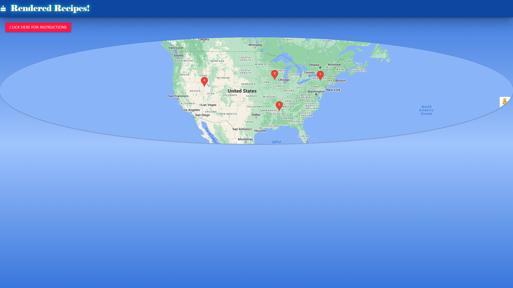

# agile-avengers

## Description
There are different recipes and diets all throughout the world. Rendered Recipes is and important application that allows for easy access to some of the most popular recipes of the United States of America, sorted by region. Its as simple as a click of button, and was designed for food lovers, and chefs all over the world. Rendered Recipes not only give access to popular recipes, but links on how to prepare them as well. 

### Usage
Users can click on the red instructions modal for more information on how to use the application. Next, user can click on a red pin located on the map of the United States to access popular recipes for that selected region. Users should read the recipe information, and if interested click on the "check out recipe her link" for more information on the ingredients and preparation of the dish. If the user wishes to save the recipe for future use, they may click on the black button labeled "Favorite this Recipe." When the user returns to the web page, they will be able to quick access the desired recipe.

#### Credits
Contributors include: Anthony Pileggi (https://github.com/Adpileggi), Kainoa Furtado (https://github.com/Kainoazooyork), and Paris Woods (https://github.com/pwoods125). 

##### Picture of Application
;

###### Deployed Application Link
https://adpileggi.github.io/agile-avengers/
